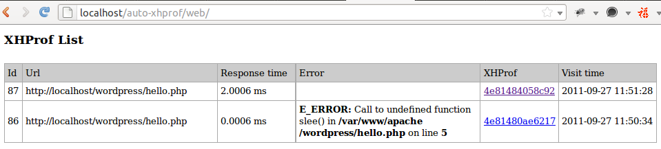

======
auto xhprof
======

通过在php.ini全局预加载脚本，实现自动记录错误和性能分析数据到数据库。如支持Gearman，则异步保存数据。

依赖软件：

    XHProf                  http://pecl.php.net/package/xhprof
    Gearman                 http://gearman.org/
                            http://pecl.php.net/package/gearman
    MySQL                   http://www.mysql.com

文件列表说明：

    php.ini                 auto_prepend_file和加载模块部分配置。
    auto-xhprof.php         主文件，全局加载。
    auto-xhprof.ini         配置，包括数据库、超时、是否自动打开等。
    auto-xhprof.sql         数据库初始化SQL脚本。
    web/                    页面显示，包括分析列表以及详细xhprof页面。
    xhprof_lib/             xhprof库文件。
    gearman-worker.php      gearman后台处理worker进程。

php.ini配置：

    ; load auto-xhporf.php
    auto_prepend_file = '/path/auto-xhprof.php'

    ; load xhprof module
    [xhprof]
    extension = xhprof.so
    xhprof.output_dir = /tmp

    ; load gearman module
    [gearman]
    extension = gearman.so

auto-xhprof相关配置：

    [auto_xhprof]
    xhprof.autostart = 1
    xhprof.timeout   = 2000
    xhprof.ignore    = 'xhprof;phpmyadmin'
    database.dsn     = 'mysql:host=127.0.0.1;dbname=xhprof'
    database.user    = 'root'
    database.pass    = '123456'
    ;gearman.server   = '127.0.0.1:4730;127.0.0.1:4730'

Gearman后台使用示例：

    % gearmand -vvv -q libdrizzle --libdrizzle-host=127.0.0.1\
       --libdrizzle-user=root --libdrizzle-password=123456 --libdrizzle-db=gearman\
       --libdrizzle-table=queue --libdrizzle-mysql

    % php gearman-worker.php &

页面显示修改index.php/callgraph.php中$xhprof_runs_impl实例部分，修改成XHProfRuns_DB：

    $xhprof_runs_impl = new XHProfRuns_DB();
    //$xhprof_runs_impl = new XHProfRuns_Default();

__EOF__
